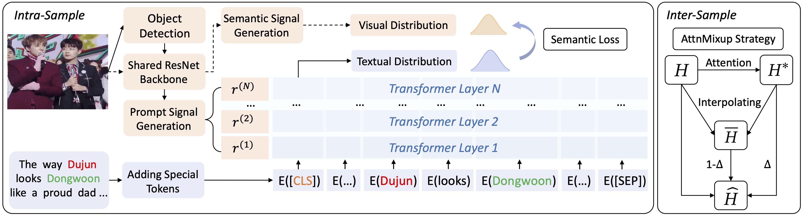

# I2SRM

Code for ACM Multimedia Asia 2023 paper [I2SRM: Intra- and Inter-Sample Relationship Modeling for Multimodal Information Extraction](https://arxiv.org/abs/2310.06326).

1 . An overview
==========
<div align=center>

</div>
The approach includes the intra-sample and inter-sample relationship modeling modules. 
The intra-sample relationship modeling module can rectify different modality distributions.
The inter-sample relationship modeling module can enhance representations across samples by AttnMixup Strategy.

Please install the following requirements:
```
transformers==4.11.3
torchvision==0.8.2
torch==1.7.1
```

2 . Dataset Preparation
==========
The multimodal relation extraction dataset MNRE can be downloaded [here](https://drive.google.com/file/d/1q5_5vnHJ8Hik1iLA9f5-6nstcvvntLrS/view?usp=sharing).

The multimodal named entity recognition: Twitter2015 and Twitter2017 can be downloaded here ( [twitter-2015](https://drive.google.com/file/d/1qAWrV9IaiBadICFb7mAreXy3llao_teZ/view?usp=sharing) and [twitter-2017](https://drive.google.com/file/d/1ogfbn-XEYtk9GpUECq1-IwzINnhKGJqy/view?usp=sharing) ).

3 . Quick start
==========
To train the I2SRM model, please use the following bash command:

```shell
bash run.sh
```

4 . Result testing
==========

For testing, please delete the "--save_path" line and add load your checkpoint by leveraging "--load_path".


5 . Citation
==========


If you find our paper inspiring, please cite:

```bibtex
@article{huang2023i2srm,
  title={I2SRM: Intra-and Inter-Sample Relationship Modeling for Multimodal Information Extraction},
  author={Huang, Yusheng and Lin, Zhouhan},
  journal={arXiv preprint arXiv:2310.06326},
  year={2023}
}
```
